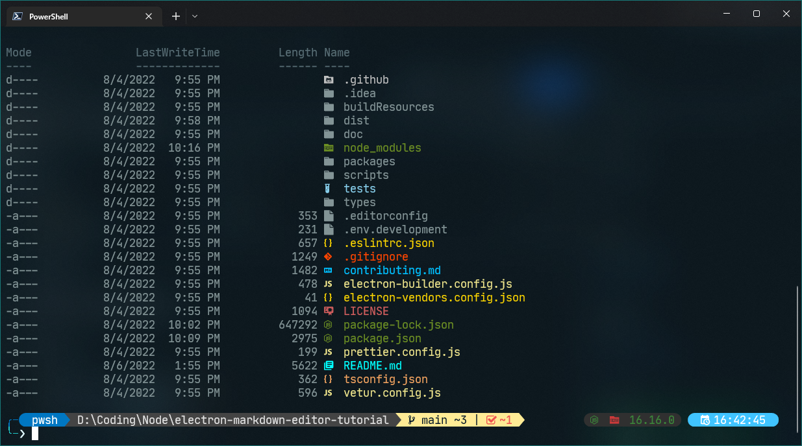

# dotfiles-windows

## Contents:
 - Include Neovim 0.7 Setup for Coding
 - Include Windows Terminal setup for coding
 - Include terminal theme file for using

## Installation:
> Just for Windows

1. Download the Terminal
- Using Windows Store to install "Windows Terminal" and "Powershell"
- Set new Powershell as the default
- Install [Nerdfont](https://www.nerdfonts.com/) and set to default font in the Terminal
- Start Windows Terminal

2. Setup
- Install scoop:
```powershell
Set-ExecutionPolicy RemoteSigned -Scope CurrentUser # Optional: Needed to run a remote script the first time
irm get.scoop.sh | iex
```
- Install packages:
```powershell
scoop install python && scoop install git && scoop install oh-my-posh && scoop install nvm && scoop install sudo && nvm install lts && sudo nvm use lts

scoop bucket add java && scoop install openjdk && scoop install gcc && scoop install neovim

Install-Module -Name Terminal-Icons
```

- Set the PROFILE files:
  - Move folder with the name "powershell" inside of "%USER%/.config/"
  - From powershell:
 
```
nvim $PROFILE
```

  - Copy and paste this into the file by using Ctrl + Shift + V:

```
. $env:USERPROFILE\.config\powershell\user_profile.ps1

oh-my-posh init pwsh --config ~/ohmyposh.omp.json | Invoke-Expression

```
> Change `~/ohmyposh.omp.json` to the path that you want to put the `ohmyposh.omp.json`

  - From Powershell
```
.$PROFILE
```

3. Result:

